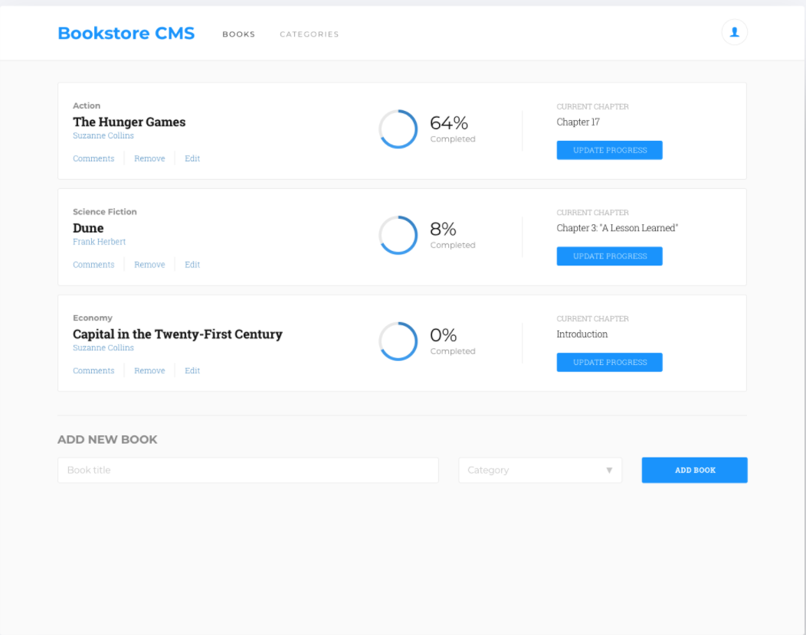

# Bookstore

> "Bookstore" is a simple website that displays a list of books and allows you to add and remove books from that list.

## Built With

- React
- Redux
- Webpack

## Live Demo

[Live Demo Link](https://jaflih.github.io/bookstore/)

## Getting Started

### Get a local copy of the project

`git clone https://github.com/jaflih/bookstore.git`

### Install

`cd bookstore`
`npm install`

Install the app with its dependencies.

### Runs the app in the development mode

`npm start`

Open [http://localhost:3000](http://localhost:3000) to view it in your browser.

The page will reload when you make changes.
You may also see any lint errors in the console.

### Test

`npm test`

Launches the test runner in the interactive watch mode.

### Builds the app for production

`npm run build`

It correctly bundles React in production mode and optimizes the build for the best performance.
The build is minified and the filenames include the hashes.
Your app is ready to be deployed!

## Authors

👤 **JihaneH**

- GitHub: [@githubhandle](https://github.com/jaflih)
- LinkedIn: [LinkedIn](https://www.linkedin.com/in/jaflih/)

## 🤝 Contributing

Contributions, issues, and feature requests are welcome!

Feel free to check the [issues page](../../issues/).

## Show your support

Give a ⭐️ if you like this project!

## 📝 License

This project is [MIT](./MIT.md) licensed.
